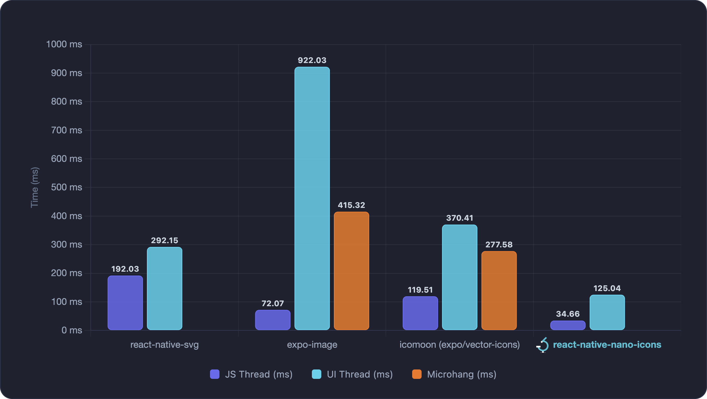

<div align="center">


<br>
</div>

# High-performance, build-time icon font generation and rendering for React Native & Expo

`react-native-nano-icons` automates the conversion of SVG directories into optimized, **multi-color-aware** native fonts and strictly typed TypeScript component factories. It leverages a WebAssembly-powered [`skia/pathops`](https://github.com/google/skia/tree/main/src/pathops) binary build pipeline to recalculate your vectors into a glyph-friendly manner, ensuring **pixel-perfect geometry and zero runtime overhead**.
<br><br>
NanoIcons are rendered directly via [CoreText](https://developer.apple.com/documentation/coretext/) (iOS) and [Canvas](<https://developer.android.com/reference/android/graphics/Canvas#drawText(java.lang.String,%20float,%20float,%20android.graphics.Paint)>) (Android), bypassing redundant [Yoga](http://github.com/facebook/yoga) text layout calculations, resulting in **blazing-fast performance** 🔬⚡️


<details>
<summary><strong>Performance Benchmarks</strong></summary>

The following picture represents the average time taken to render the same 1k SVG icon set input in a simple ScrollView using different libraries across both JS and UI (Main) thread for iOS (26.2) release app version. Same testcase results in similar output for most of the android devices depending on their hardware. Nano Icons present a significant adventage over similar libraries.

<div align="center">
  
</div>

</details>


---

<h2 style="display: inline"> 🧩 Platforms Supported </h2> <a href="https://reactnative.dev/architecture/landing-page" style="font-size: 1rem; font-weight: normal">(New Arch Only)</a>

<br>

- [x] iOS 15.1+
- [x] Android API 24+
- [x] Web
- [ ] Expo Go App


## 🚀 Usage

### 1. Installation

```bash
npm install react-native-nano-icons
```

### 2. Configuration

#### 2.1. Expo

The library uses an Expo Config Plugin to hook into the prebuild phase. This automatically generates the `.ttf` and corresponding `glyphmap` files and links them to the native iOS/Android project's assets.

`app.json`

```JSON
{
  "expo": {
    "plugins": [
      [
        "react-native-nano-icons",
        {
          "iconSets": [
            {
              "inputDir": "./assets/icons/user"
            }
          ]
        }
      ]
    ]
  }
}
```

<details>
<summary><u>All iconSets Entry Plugin Options</u></summary>

The plugin accepts an object with an `iconSets` array, allowing you to generate multiple distinct fonts in a single build.

| Property       | Type     | Required | Default        | Description                                                                                                                |
| :------------- | :------- | :------- | :------------- | :------------------------------------------------------------------------------------------------------------------------- |
| `inputDir`     | `string` | **Yes**  | —              | Path to the directory containing your `.svg` files (e.g., `./assets/icons/ui`).                                            |
| `fontFamily`   | `string` | No       | Folder Name    | The name of the generated font family and file. If omitted, the name of the `inputDir` folder is used (e.g., `ui`).        |
| `outputDir`    | `string` | No       | `../nanoicons` | Path where the `.ttf` and `.json` artifacts will be saved. Defaults to a sibling `nanoicons` folder relative to the input. |
| `upm`          | `number` | No       | `1024`         | Units Per Em. Defines the resolution of the font grid.                                                                     |
| `startUnicode` | `string` | No       | `0xe900`       | The starting Hex Unicode point for the first icon glyph.                                                                   |

  <details>
  <summary>Default Dir Path Behavior</summary>
  If you do not specify an `outputDir` or `fontFamily`, the library attempts to keep your project organized by creating a   sibling folder.

- **Input:** `./assets/icons/user`
- **Resulting Output:** `./assets/icons/nanoicons/user.ttf` & `user.glyphmap.json`
  </details>
  </details>

#### 2.2 Bare React Native/React Native Web (no Expo)

Bare apps don’t have a prebuild step, so you run the same pipeline via the CLI yourself:

1. **Config** – Add a `.nanoicons.json` with the same `iconSets` shape as the Expo plugin (see "All iconSets Entry Plugin Options" above) to your project.
   <details>
    <summary>.nanoicons.json example</summary>
    
    ```JSON
    {
      "iconSets": [
        {
          "inputDir": "./assets/icons/brand"
        }
      ]
    }
    ```
    
    </details>

2. **Build and link** – From the app root run:

   ```sh
   npx react-native-nano-icons --path path/to/.nanoicons.json
   ```

   This works exactly like the config plugin, removing any necessity for manual Xcode/Android Studio font linking steps.

> [!TIP]
> Run `EXPO_DEBUG=1 npx expo prebuild` or `npx react-native-nano-icons --verbose` to get font build-time logs.

> [!NOTE]
> Linking the font on web is just as straightforward as always and does not require any actions other than the usual font addition.

### 3. Component Usage

```TypeScript
import { View, Text } from 'react-native'
import { createNanoIconSet } from "react-native-nano-icons";
// auto-generated during build-time in outputDir
import glyphMap from "./assets/icons/nanoicons/brand.glyphmap.json";

export const BrandIcon = createNanoIconSet(glyphMap);

export default function App() {
  return (
    <View>
      // Renders the icon with its original multi-color layers from the SVG
      <BrandIcon name="logo-light" size={32} />

      // Overrides all color layers with the provided colors respectively
      <BrandIcon name="logo-light" size={24} color={["blue", "#ffffff", "#fc2930"]} />

      // Renders icon inline within a paragraph
      <Text>
        Welcome to <BrandIcon name="logo-light" size={12} /> app!
      </Text>
    </View>
  );
}
```
**Props:**

| Prop                 | Type                         | Default           | Description                                                                                                                                  |
| -------------------- | ---------------------------- | ----------------- | -------------------------------------------------------------------------------------------------------------------------------------------- |
| `name`               | `string`                     | **(required)**    | Icon name — **corresponds to its original SVG filename**. Fully typed from the glyphmap.                                                     |
| `size`               | `number`                     | `12`              | Icon size in points.                                                                                                                         |
| `color`              | `ColorValue \| ColorValue[]` | Glyphmap defaults | Single color applied to all layers, or per-layer color array. If the array is shorter than the number of layers, the last color is repeated. |
| `allowFontScaling`   | `boolean`                    | `true`            | Whether the icon size respects the system accessibility font scale.                                                                          |
| `style`              | `ViewStyle`                  | —                 | Style applied to the icon container.                                                                                                         |
| `accessible`         | `boolean`                    | —                 | Override the default accessibility behavior.                                                                                                 |
| `accessibilityLabel` | `string`                     | Icon `name`       | Label announced by screen readers. Defaults to the icon name.                                                                                |
| `accessibilityRole`  | `AccessibilityRole`          | `"image"`         | Accessibility role. Defaults to `"image"` so the icon is not misinterpreted as text.                                                         |
| `testID`             | `string`                     | —                 | Test identifier for e2e testing frameworks.                                                                                                  |
| `ref`                | `Ref<View>`                  | —                 | Ref to the underlying native view.                                                                                                           |

Your color icon can have as many colors as your original SVG has; therefore, you should experiment to establish which element of the array corresponds to the layer you aim to change the color of. <br>
If the icon is single-color by design (which results in creating a single glyph at build time), you can either pass a direct string or the array, but only the first element is considered, and if the `color` array is too short — the last color is repeated.

> [!IMPORTANT]
> You should always verify your icons visually.

### 4. Font Regeneration

**The script detects changes in path and contents of the SVGs** in your input directory based on a fingerprint hash. Had anything changed (i.e. file names, svg attributes/nodes), or the output font/glyphmap files had been deleted, a given icon-set is regenerated during `prebuild` or manual script run.

---

## Limitations

> [!NOTE]
> `<filter>` and `<mask>` are not yet supported, due to native fonts' glyph limitations.
> In order to leverage those features, use [`react-native-svg`](https://github.com/software-mansion/react-native-svg) or [`expo-image`](https://docs.expo.dev/versions/latest/sdk/image/)
> 
---

## Contributing

The main purpose of this repository is to fill the lack of CLI tooling around proper SVG->font conversion without having to leave your IDE, and to ensure as performant font icon rendering as possible.
<br>We want to make contributing to this project as easy and transparent as possible, and we are grateful to the community for contributing bug fixes and improvements. Read below to learn how you can take part in improving React Native.

<details>
<summary>Repo Navigation</summary>
<br>
This repository is a yarn workspaces monorepo containing the library package and example apps.

#### Package

- **Library source:** [`packages/react-native-nano-icons/`](packages/react-native-nano-icons/)

#### Examples

- **Bare React Native app:** [`examples/BareReactNativeExample/`](examples/BareReactNativeExample/)
- **Expo app:** [`examples/ExpoExample/`](examples/ExpoExample/)
</details>


#### Code of Conduct
We adopted a Code of Conduct that we expect project participants to adhere to. Please read the [full text](CODE_OF_CONDUCT.md) so that you can understand what actions will and will not be tolerated.


---

## License

`react-native-nano-icons` is released under the **MIT License**. See [LICENSE](LICENSE) for the full text.

---

## Nano Icons are created by Software Mansion

[](https://swmansion.com)

Since 2012 [Software Mansion](https://swmansion.com) is a software agency with
experience in building web and mobile apps. We are Core React Native
Contributors and experts in dealing with all kinds of React Native issues. We
can help you build your next dream product –
[Hire us](https://swmansion.com/contact/projects?utm_source=react-native-nano-icons&utm_medium=readme).

<!-- automd:contributors author="software-mansion" -->

Made by [@software-mansion](https://github.com/software-mansion) 💛
<br><br>
<a href="https://github.com/software-mansion-labs/react-native-nano-icons/graphs/contributors">

</a>
