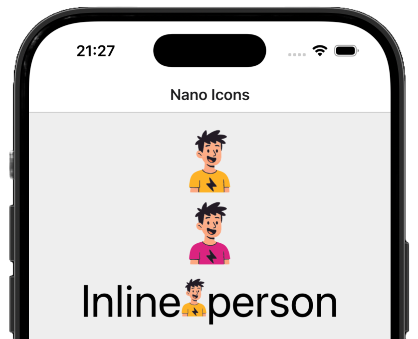

<div align="center">


<br>
</div>

`react-native-nano-icons`

# High-performance icon rendering for React Native & Expo.

Nano Icons is the fastest way to render icons in React Native. Point it at a folder of SVGs and get **blazing-fast, native icon rendering with near-zero overhead**. It works great for any app that uses icons, and is at its best when the same small symbols appear many times on screen — row icons in a list, tab bars, inline badges. [See benchmarks →](#-performance)

## Why not just use…
`react-native-svg` — It works, but it wasn’t designed for icons. Every SVG component spins up a full React subtree that gets parsed, reconciled, and laid out on each mount. One icon is fine. Fifty in a scrollable list and your UI starts paying for it ([read more](https://swmansion.com/blog/you-might-not-need-react-native-svg-b5c65646d01f)).

`expo-image` and similar — A better choice for complex vector graphics, but each image goes through its own rasterization pipeline. That’s not optimized for drawing many copies of the same small symbol, and the per-image overhead makes it better suited for richer graphics than tiny repeated icons.

`react-native-vector-icons` — Already font-based, so rendering is fast. Great if you’re using a bundled icon pack like MaterialIcons or FontAwesome. But if you need your own custom icons, you’re back to managing font files manually with external tools — exactly the workflow Nano Icons eliminates.

## How Nano Icons works
At build time, your SVGs are automatically converted into an optimized icon font. At runtime, each icon renders as a single native text glyph stack — bypassing React’s component tree entirely. The result is dramatically less work per icon, especially in screens with many repeated symbols: lists, tab bars, buttons, inline badges.
Drop your SVGs in a folder. Use them as a fully typed component by name. 
That’s it 🔬⚡️


---

## Table of Contents

- [🧩 Platforms Supported](#-platforms-supported)
- [🚀 Quick Start](#-quick-start)
- [🎨 Multicolor Icons](#-multicolor-icons)
- [📊 Performance](#-performance)
- [⚠️ Known Limitations](#%EF%B8%8F-known-limitations)
- [🔧 Font Generation Pipeline](#-how-it-works)
- [🤝 Contributing](#-contributing)

---

## 🧩 Platforms Supported

- [x] React Native 0.74+ [(New Arch Only)](https://reactnative.dev/architecture/landing-page)
- [x] iOS 15.1+
- [x] Android API 24+
- [x] Web
- [x] Expo Go

---

## 🚀 Quick Start

### 1. Install

```bash
npm install react-native-nano-icons
```

### 2. Add your SVGs

Create a directory for your icon set and place your `.svg` files in it. Only `*.svg` format is supported.

```
assets/icons/my-icons/
├── heart.svg
├── search.svg
├── flag-us.svg
└── ...
```

File names become icon names: `heart.svg` is rendered with `<Icon name="heart" />`.

### 3. Configure

#### Expo (Development build)

The library uses an Expo Config Plugin to hook into the prebuild phase. This automatically generates the `.ttf` and corresponding `glyphmap` files and links them to the native iOS/Android project's assets.

`app.json`

```JSON
{
  "expo": {
    "plugins": [
      [
        "react-native-nano-icons",
        {
          "iconSets": [
            {
              "inputDir": "./assets/icons/my-icons"
            }
          ]
        }
      ]
    ]
  }
}
```

<details>
<summary><u>All iconSets Entry Plugin Options</u></summary>

The plugin accepts an object with an `iconSets` array, allowing you to generate multiple distinct fonts in a single build.

| Property       | Type     | Required | Default        | Description                                                                                                                |
| :------------- | :------- | :------- | :------------- | :------------------------------------------------------------------------------------------------------------------------- |
| `inputDir`     | `string` | **Yes**  | —              | Path to the directory containing your `.svg` files (e.g., `./assets/icons/ui`).                                            |
| `fontFamily`   | `string` | No       | Folder Name    | The name of the generated font family and file. If omitted, the name of the `inputDir` folder is used (e.g., `ui`).        |
| `outputDir`    | `string` | No       | `../nanoicons` | Path where the `.ttf` and `.json` artifacts will be saved. Defaults to a sibling `nanoicons` folder relative to the input. |
| `upm`          | `number` | No       | `1024`         | Units Per Em. Defines the resolution of the font grid.                                                                     |
| `startUnicode` | `string` | No       | `0xe900`       | The starting Hex Unicode point for the first icon glyph.                                                                   |

  <details>
  <summary>Default Dir Path Behavior</summary>
  If you do not specify an `outputDir` or `fontFamily`, the library attempts to keep your project organized by creating a   sibling folder.

- **Input:** `./assets/icons/user`
- **Resulting Output:** `./assets/icons/nanoicons/user.ttf` & `user.glyphmap.json`
  </details>
  </details>

#### Bare React Native / React Native Web / Expo Go

Bare apps don't have a prebuild step, so you run the same pipeline via the CLI:

1. **Config** – Add a `.nanoicons.json` with the same `iconSets` shape as the Expo plugin (see options above).
   <details>
    <summary>.nanoicons.json example</summary>

   ```JSON
   {
     "iconSets": [
       {
         "inputDir": "./assets/icons/my-icons"
       }
     ]
   }
   ```

    </details>

2. **Build and link** – From the app root run:

   ```sh
   npx react-native-nano-icons --path path/to/.nanoicons.json
   ```

   This works exactly like the config plugin, removing any necessity for manual Xcode/Android Studio font linking steps.

> [!TIP]
> Run `EXPO_DEBUG=1 npx expo prebuild` or `npx react-native-nano-icons --verbose` to get font build-time logs.

> [!NOTE]
> Linking the font on web is just as straightforward as always and does not require any actions other than the usual web font addition.
>
> In [Expo Go](https://expo.dev/go), icons are rendered using a regular `<Text>` fallback so you can iterate quickly. You will need to link the font manually via the already included [`expo-font` library](https://docs.expo.dev/versions/latest/sdk/font/). [Once you move to a development build](https://docs.expo.dev/develop/development-builds/expo-go-to-dev-build/), the library automatically switches to the native component implementation. Remember to remove any `expo-font`-related icon font setup after the switch.

### 4. Use

```TypeScript
import { View, Text } from 'react-native'
import { createNanoIconSet } from "react-native-nano-icons";
// auto-generated during build in outputDir
import glyphMap from "./assets/icons/nanoicons/my-icons.glyphmap.json";

export const Icon = createNanoIconSet(glyphMap);

export default function App() {
  return (
    <View>
      <Icon name="heart" size={24} color="tomato" />

      {/* Icons work inline with text */}
      <Text>
        Tap <Icon name="heart" size={12} color="tomato" /> to save
      </Text>
    </View>
  );
}
```

#### Props

| Prop                 | Type                         | Default           | Description                                                                                                                                  |
| -------------------- | ---------------------------- | ----------------- | -------------------------------------------------------------------------------------------------------------------------------------------- |
| `name`               | `string`                     | **(required)**    | Icon name — corresponds to the original SVG filename. Fully typed from the glyphmap.                                                         |
| `size`               | `number`                     | `12`              | Icon size in points.                                                                                                                         |
| `color`              | `ColorValue \| ColorValue[]` | Glyphmap defaults | Single color applied to all layers, or per-layer color array. If the array is shorter than the number of layers, the last color is repeated. |
| `allowFontScaling`   | `boolean`                    | `true`            | Whether the icon size respects the system accessibility font scale.                                                                          |
| `style`              | `ViewStyle`                  | —                 | Style applied to the icon container.                                                                                                         |
| `accessible`         | `boolean`                    | —                 | Override the default accessibility behavior.                                                                                                 |
| `accessibilityLabel` | `string`                     | Icon `name`       | Label announced by screen readers. Defaults to the icon name.                                                                                |
| `accessibilityRole`  | `AccessibilityRole`          | `"image"`         | Accessibility role. Defaults to `"image"` so the icon is not misinterpreted as text.                                                         |
| `testID`             | `string`                     | —                 | Test identifier for e2e testing frameworks.                                                                                                  |
| `ref`                | `Ref<View>`                  | —                 | Ref to the underlying native view.                                                                                                           |

### 5. Font Regeneration

**The build script detects changes in path and contents of the SVGs** in your input directory based on a fingerprint hash. If anything changes (file names, SVG attributes/nodes) or the output font/glyphmap files are deleted, the icon set is regenerated during `prebuild` or manual script run.

---

## 🎨 Multicolor Icons

At build time, each SVG is split by fill color — every distinct color becomes a separate glyph layer in the font. At render time, layers are stacked on top of each other to reconstruct the original image.

This makes the library well-suited for multicolor icons like country flags, brand logos, or any icon with distinct color regions:

```TypeScript
// Renders with the original SVG colors
<Icon name="person" size={52} />

// Override individual layer colors
<Icon name="person" size={52} color={['#DB227F', '#FDA780', '#231B25','#140E19']} />

<Text>
  Inline<Icon name="person" size={32} />person
</Text>
```

<div align="center">
  
</div>
<br>

**Color prop behavior:**

- **Single string** — applies to all layers.
- **Array** — each element maps to a layer. If the array is shorter than the number of layers, the last color is repeated.
- **Omitted** — uses the original SVG colors stored in the glyphmap.

An SVG with many distinct colors (e.g., a detailed vector image with 50 colors) produces at least 50 glyph layers. Each layer is a lightweight text glyph, so this is fine for typical icons (3–10 colors). For highly complex illustrations with dozens of colors, consider using `expo-image` instead.

Since all of that is actually simple text, you can use your beautiful multicolor SVG designs **inline within a regular** `<Text>` **component** without fighting the layout engine.

> [!IMPORTANT]
> You should always verify your icons visually.

---

## 📊 Performance

Native text engines are among the most optimized rendering pipelines in any OS. Rendering a glyph from a `.ttf` is synchronous and memory-efficient — unlike SVG, which requires XML parsing, native view tree creation, and Yoga layout calculation per icon instance.

We measured the average time to render a screen with identical set of 1,000 different multicolor icons in a ScrollView on iOS (release build).

| Library                                                                         | What it is                | Rendering approach               | Multicolor                                                                                                                           |
| :------------------------------------------------------------------------------ | :------------------------ | :------------------------------- | :----------------------------------------------------------------------------------------------------------------------------------- |
| [`react-native-svg`](https://github.com/software-mansion/react-native-svg)      | Full SVG renderer         | Native view tree per icon        | Yes (full SVG spec)                                                                                                                  |
| [`expo-image`](https://docs.expo.dev/versions/latest/sdk/image/)                | Universal image component | Async image decode + cache       | N/A (raster)                                                                                                                         |
| [`@expo/vector-icons`](https://docs.expo.dev/versions/latest/sdk/vector-icons/) | Icon fonts via IcoMoon    | Color Table Font glyph rendering | Limited - [not supported on Android API level below 33](https://developer.android.com/about/versions/13/features#color-vector-fonts) |
| `react-native-nano-icons`                                                       | Build-time SVG-to-font    | Font glyph rendering (layered)   | Yes (full API support)                                                                                                               |

> [!NOTE]
> These libraries serve different primary purposes. `expo-image` is the go-to image library for photos and remote assets. `@expo/vector-icons` ships with many popular icon sets built in. `react-native-svg` handles the full SVG specification with fine-grained attribute control. We compare them here specifically on the use case of rendering many small, static icons.

<div align="center">
  
</div>
<br>

The chart shows time in milliseconds across three phases: **JS Thread** (JavaScript execution), **UI Thread** (native rendering on the main thread), and **Microhang** (main thread stall during initial load that can cause visible UI freezes — see [Apple's documentation on hangs](https://developer.apple.com/documentation/xcode/understanding-hangs-in-your-app)).

> [!NOTE]
> For full methodology, device specifications, and reproduction steps see [BENCHMARKS.md](packages/react-native-nano-icons/docs/BENCHMARKS.md).

---

## ⚠️ Known Limitations

- SVG `<filter>` and `<mask>` elements are not supported — font glyphs cannot represent these effects.
- Only `*.svg` input files are supported.

---

## 🔧 Font Generation Pipeline


At build time, the pipeline processes your SVG directory through four stages:

1. **SVG optimization** - Simplifies the SVG structure removing unnecessary tags for further processing.
2. **Geometry flattening** — Transforms, clip paths, and overlapping shapes are resolved into simple path-only geometry using a WebAssembly build of [`Skia/pathops`](https://github.com/google/skia/tree/main/src/pathops).
3. **Color layer extraction** — Each distinct fill color in an SVG is separated into its own layer.
4. **Font compilation** — Layers are compiled into a standard `.ttf` font file, with each layer mapped to a private-use Unicode codepoint.
5. **Glyphmap generation** — A compact `.glyphmap.json` is created, mapping icon names to their codepoints, default colors, and metrics.

At runtime, the native component stacks glyph layers at the same position — one `drawGlyphs` call per layer via [CoreText](https://developer.apple.com/documentation/coretext/) (iOS) or `drawText` via [Canvas](<https://developer.android.com/reference/android/graphics/Canvas#drawText(java.lang.String,%20float,%20float,%20android.graphics.Paint)>) (Android). On web and Expo Go, a pure `react-native` fallback uses stacked `<Text>` elements.

---

## 🤝 Contributing

We want to make contributing to this project as easy and transparent as possible, and we are grateful to the community for contributing bug fixes and improvements. Read below to learn how you can take part in improving `react-native-nano-icons`.

<details>
<summary>Repo Navigation</summary>
<br>
This repository is a yarn workspaces monorepo containing the library package and example apps.

#### Package

- **Library source:** [`packages/react-native-nano-icons/`](packages/react-native-nano-icons/)

#### Examples

- **Bare React Native app:** [`examples/BareReactNativeExample/`](examples/BareReactNativeExample/)
- **Expo app:** [`examples/ExpoExample/`](examples/ExpoExample/)
</details>

#### Code of Conduct

We adopted a Code of Conduct that we expect project participants to adhere to. Please read the [full text](CODE_OF_CONDUCT.md) so that you can understand what actions will and will not be tolerated.

---

## License

`react-native-nano-icons` is released under the **MIT License**. See [LICENSE](LICENSE) for the full text.

---

## Nano Icons are created by Software Mansion

[](https://swmansion.com)

Since 2012 [Software Mansion](https://swmansion.com) is a software agency with
experience in building web and mobile apps. We are Core React Native
Contributors and experts in dealing with all kinds of React Native issues. We
can help you build your next dream product –
[Hire us](https://swmansion.com/contact/projects?utm_source=react-native-nano-icons&utm_medium=readme).

<!-- automd:contributors author="software-mansion" -->

Made by [@software-mansion](https://github.com/software-mansion) 💛
<br><br>
<a href="https://github.com/software-mansion-labs/react-native-nano-icons/graphs/contributors">

</a>
