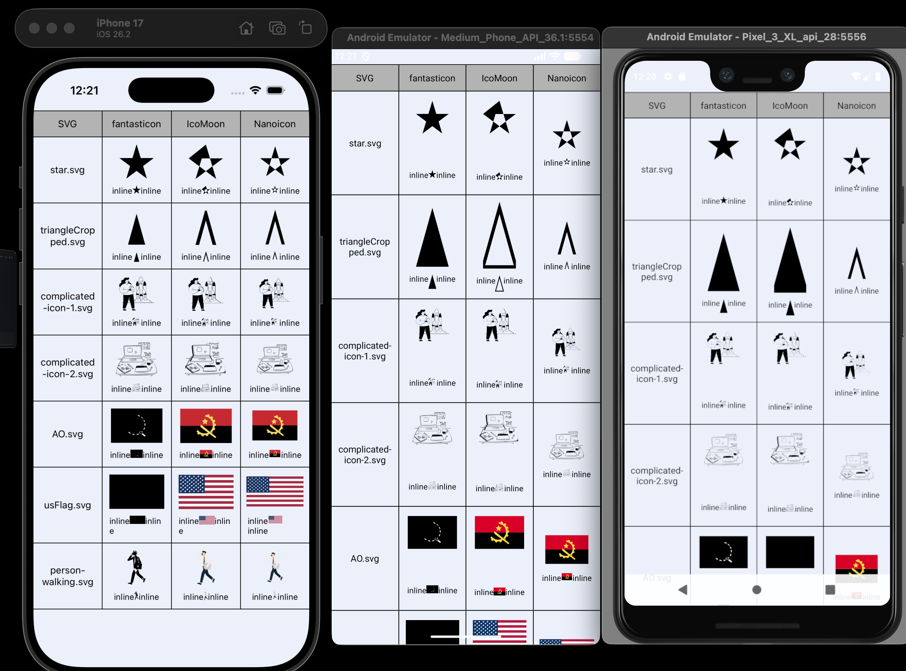
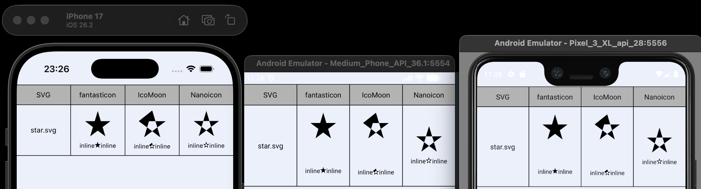
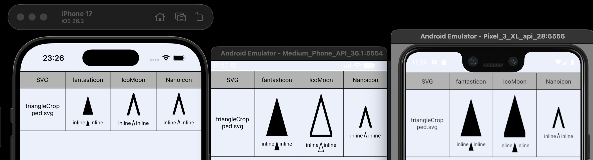
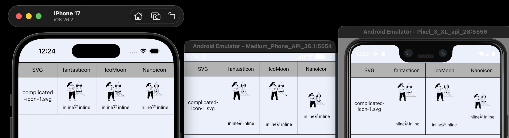
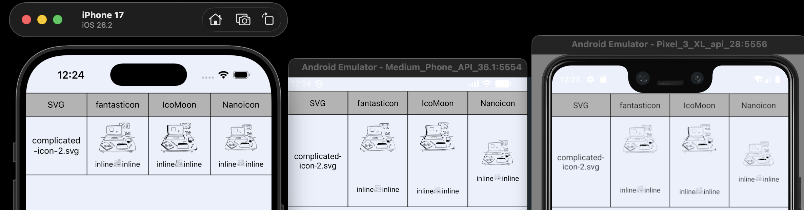
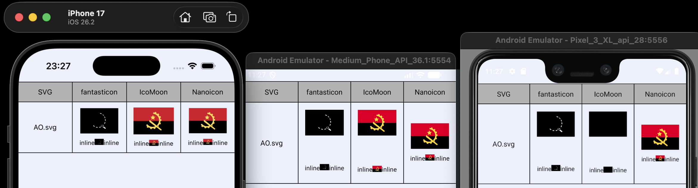
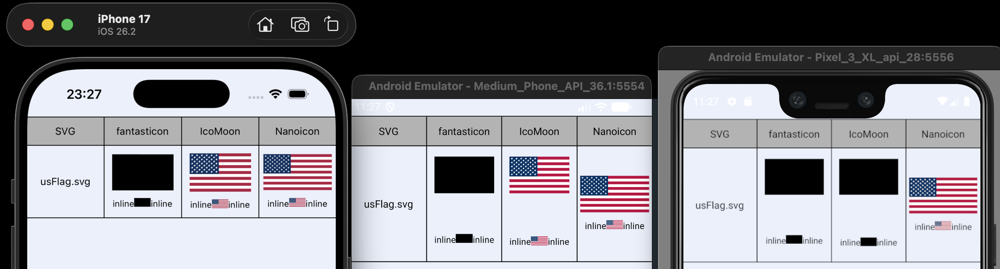
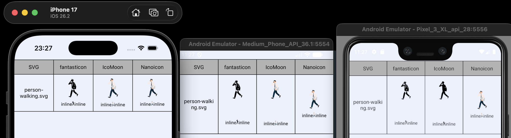

Table of contents:

- [💡🔨 Architecture \& Pipeline — Decision-Making Process](#-architecture--pipeline--decision-making-process)
  - [0. The Problem: SVGs in React Native](#0-the-problem-svgs-in-react-native)
  - [1. Scope and non-goals](#1-scope-and-non-goals)
  - [2. Requirements and constraints](#2-requirements-and-constraints)
    - [Functional requirements](#functional-requirements)
    - [Key technical constraints](#key-technical-constraints)
  - [3. Rendering strategy and color model](#3-rendering-strategy-and-color-model)
    - [Why native fonts (instead of SVG rendering at runtime)](#why-native-fonts-instead-of-svg-rendering-at-runtime)
    - [Why we intentionally do _not_ ship COLR/CPAL (COLRv0 / COLRv1) today](#why-we-intentionally-do-not-ship-colrcpal-colrv0--colrv1-today)
    - [Our approach (core design)](#our-approach-core-design)
  - [4. Architecture overview (current implementation)](#4-architecture-overview-current-implementation)
    - [Pipeline stages](#pipeline-stages)
    - [Summary](#summary)
  - [5. The geometry challenge: why pathops matters](#5-the-geometry-challenge-why-pathops-matters)
  - [6. Pyodide as proof of concept; long-term geometry strategy](#6-pyodide-as-proof-of-concept-long-term-geometry-strategy)
    - [Current decision](#current-decision)
    - [Future possibility](#future-possibility)
- [⚒️🔍 Tooling analysis: existing solutions vs our pipeline](#️-tooling-analysis-existing-solutions-vs-our-pipeline)
  - [1. Fantasticon (Node CLI)](#1-fantasticon-node-cli)
    - [Strengths](#strengths)
    - [Limitations for our requirements](#limitations-for-our-requirements)
    - [Bottom line](#bottom-line)
  - [2. IcoMoon (web app; v2 beta)](#2-icomoon-web-app-v2-beta)
    - [Strengths relevant to our evaluation](#strengths-relevant-to-our-evaluation)
    - [Cons](#cons)
    - [Bottom line](#bottom-line-1)
  - [3. Terminal / CI tooling for COLRv0](#3-terminal--ci-tooling-for-colrv0)
    - [What we found](#what-we-found)
    - [Practical downside](#practical-downside)
    - [Implication](#implication)
- [🕵🏻‍♂️🎨 Practical comparisons](#️-practical-comparisons)
  - [Goals](#goals)
  - [Font table listings (`ttx -l` via `fonttools` CLI)](#font-table-listings-ttx--l-via-fonttools-cli)
    - [Fantasticon — `Fantasticon.ttf`](#fantasticon--fantasticonttf)
    - [IcoMoon (new-app-beta) — `Icomoon.ttf`](#icomoon-new-app-beta--icomoonttf)
    - [Ours — `RNNanoIcons.ttf`](#ours--rnnanoiconsttf)
  - [Key interpretation from tables](#key-interpretation-from-tables)
    - [Native color vs non-color](#native-color-vs-non-color)
    - [Sizes are largely “glyf driven”](#sizes-are-largely-glyf-driven)
  - [Cross-platform rendering notes observed in this test run](#cross-platform-rendering-notes-observed-in-this-test-run)
    - [Android font-metrics padding (Fantasticon + IcoMoon)](#android-font-metrics-padding-fantasticon--icomoon)
    - [Inline baseline alignment (RNNanoIcons)](#inline-baseline-alignment-rnnanoicons)
  - [Example SVG set](#example-svg-set)
    - [Legend for “what a font pipeline must do”](#legend-for-what-a-font-pipeline-must-do)
  - [Monochrome / single-glyph test cases](#monochrome--single-glyph-test-cases)
    - [1) `star.svg` — polygon + `fill-rule="evenodd"`](#1-starsvg--polygon--fill-ruleevenodd)
    - [2) `triangle.svg` (a.k.a. `triangleCropped.svg`) — viewBox clipping + fill-rule stress](#2-trianglesvg-aka-trianglecroppedsvg--viewbox-clipping--fill-rule-stress)
    - [3) `complicated-icon-1.svg` — complex path data](#3-complicated-icon-1svg--complex-path-data)
    - [4) `complicated-icon-2.svg` — complex path data (variant)](#4-complicated-icon-2svg--complex-path-data-variant)
  - [Multicolor test cases](#multicolor-test-cases)
    - [Important note on color](#important-note-on-color)
    - [5) `AO.svg` (Angola flag) — multicolor flag](#5-aosvg-angola-flag--multicolor-flag)
    - [6) `usFlag.svg` (USA flag) — multicolor flag](#6-usflagsvg-usa-flag--multicolor-flag)
    - [7) `person-walking.svg` — multicolor illustration icon](#7-person-walkingsvg--multicolor-illustration-icon)
  - [Visual comparison matrix (actual results from this run)](#visual-comparison-matrix-actual-results-from-this-run)
  - [Appendix: References](#appendix-references)

# 💡🔨 Architecture & Pipeline — Decision-Making Process

### 0. The Problem: SVGs in React Native

Handling vector icons in React Native has historically been a trade-off between **performance**, **flexibility**, and **maintainability**.

As highlighted in [**"You might not need react-native-svg"**](https://blog.swmansion.com/you-might-not-need-react-native-svg-b5c65646d01f) by Software Mansion, the standard approaches have significant drawbacks:

- **`react-native-svg`**: While powerful, it is memory-heavy and computationally expensive. Parsing XML strings and constructing the shadow tree on the native side adds significant bridge overhead, especially for lists with hundreds of icons.
- **`expo-image` / PNGs**: Rendering is performant, but you lose vector scalability. Crucially, you cannot manipulate colors at runtime. Additionally, the asynchronous rendering pipeline often results in a split-second "blink" or layout shift when icons load.

**The Solution: Native Fonts**
Native text rendering is one of the most optimized pipelines in any OS. Rendering a character from a `.ttf` file is synchronous, memory-efficient, and roughly **3x faster** than rendering the equivalent path via `react-native-svg`.

### 1. Scope and non-goals

This document describes the technical decisions behind our **SVG → font + metadata** pipeline used to render icons in **React Native** with a focus on:

- **Performance** (fast, synchronous rendering; low memory overhead)
- **Cross-platform behavior** (Android + iOS; consistent results, even on old APIs)
- **Correct geometry** for real-world SVGs (often exported from design tools)
- **Maintainability** (stable pipeline; minimal bespoke geometry code)

Non-goals:

- nessesity to use any external web-based tooling

---

### 2. Requirements and constraints

#### Functional requirements

1. Support **single-color icons** as a simple glyph (one codepoint per icon).
2. Support **multi-color icons** with:
   - deterministic multi-layer decomposition at build time
   - the ability to **override colors per layer at runtime** (e.g., change skin tone or clothing color without producing multiple icon variants)
3. Generate deterministic build artifacts:
   - a font file in a **simple, universal glyph format** (no advanced native color tables)
   - a glyph map metadata file mapping icons → subglyphs

#### Key technical constraints

1. **Font engines accept a strict subset of SVG geometry.** Real-world SVGs often include:
   - transforms (`transform="matrix(...)"`)
   - clipping paths (`<clipPath>`)
   - masks (`<mask>`) — **not reliably supported by simplification pipelines** in general, including our own
   - winding/overlap behaviors that must be resolved into simple contours  
     Most XML-level tooling like `svgo` only rewrites markup; it doesn’t _compute_ geometry.

2. **Color font format fragmentation and API limitations**
   - Advanced color font formats are not uniformly supported across platform versions and app stacks.
   - Even when supported, native color-font APIs are usually **not designed for per-layer runtime overrides**.

---

### 3. Rendering strategy and color model

#### Why native fonts (instead of SVG rendering at runtime)

Native text rendering is one of the most optimized pipelines on mobile OSes. Rendering a glyph from a static font file is synchronous, cached, and avoids the cost of parsing XML and building a native vector tree at runtime.

#### Why we intentionally do _not_ ship COLR/CPAL (COLRv0 / COLRv1) today

Even though COLRv0 is widely compatible and COLRv1 adds richer paint features, **we do not rely on color-font tables** as our primary representation for multi-color icons.

Key reasons:

- **Predictability:** The same composition logic runs in our code, not inside platform-specific color-font stacks.
- **Tooling availability:** Node-first, deterministic COLRv0 compilation is not well supported by OSS CLI tools; the most reliable terminal tool we found is `nanoemoji`, but it relies on a heavier native toolchain ( it is a python lib with c/c++ bindings to `skia/pathops` via `picosvg` python lib and a font engine called `ninja`).
- **Runtime layer control:** We need to change a specific part of the icon (e.g., skin tone) without re-exporting or maintaining multiple variants.

#### Our approach (core design)

We represent each multi-color icon as:

- a set of **subglyph layers** (simple glyph format), each mapped to a private-use codepoint
- a generated **glyph map** describing:

```
{
  meta: {
    fontFamily": string;
    upm: number;
    safeZone: number;
    startUnicode: number;
  },
  icons: {
    iconName: {
      adv: number; // used to preserve the view box ratio
      layers: { codepoint: number; color: string }[]
    }
  }
}
```

At runtime, the Icon component:

- renders the subglyphs stacked (absolute positioning in a unified view box),
- and allows per-layer color overrides via props:
  

It is essentially a very small bunch of text in a simple container, fully embeddable inline in other `Text` components.

**Strength of this approach:**  
We keep the font format simple and universal (a `glyf` + `cmap` tables is the simplest format ever), while enabling **fine-grained color customization** without manipulating SVG trees or duplicating icon assets.

---

### 4. Architecture overview (current implementation)

#### Pipeline stages

1. **SVG → flattened, normalized, simplified paths (Pyodide + picosvg + PathKit via WASM)**
   - Input: arbitrary SVGs (often complex Figma exports)
   - Output: path-only geometry suitable for downstream font conversion tools
   - Responsibilities:
     - flatten transforms into coordinates
     - resolve clip paths via boolean operations
     - simplify and normalize contours
     - place geometry correctly relative to the viewBox / target metrics
   - Known gap:
     - SVG **mask** resolution/simplification is not reliably supported today (but fortunately, vast majority of icons do not rely on it)

2. **Flattened geometry → layer glyph extraction (Node)**
   - Parse flattened SVG DOM
   - Split shapes into layers based on fill color (multi-color decomposition)
   - Compute placement rules (viewBox normalization, UPM scaling, safe zone)
   - Emit one small SVG per layer into a temp directory (deterministic codepoints)

3. **Layer SVGs → font file + glyphmap (Node)**
   - Compile a **simple glyph font** (no COLR/CPAL; no advanced color format)
   - Append glyphs to the font in deterministic order
   - Generate glyphmap JSON: icon name → subglyph codepoints + default color(s)
   - Normalize font metrics (ascent/descent/line-height) to reduce platform drift

#### Summary

- **PathKit provides the “correct math”**: boolean ops + transform flattening + contour correctness.
- Node-based font tools are sufficient **once the SVG is reduced to a font-safe subset**.

---

### 5. The geometry challenge: why pathops matters

Font engines (FreeType, CoreText) expect simple contours. They do not implement the SVG rendering model (transforms, clipPath, mask, etc.).

Simple “SVG optimizers”, like the very popular `svgo` library, mostly manipulate XML. In contrast, our use of Skia-style PathOps via PathKit is a geometry compilation step:

- transforms → baked into points
- clipPath → boolean intersection/difference
- overlaps → resolved into stable contours

This is the main reason our pipeline can handle complicated exports: **we compute the geometry instead of hoping the font compiler tolerates it.**

**Limitations:**  
Mask semantics remain a hard gap. Even with PathOps, reliably resolving `<mask>` into equivalent contours is not solved by any piplines.

---

### 6. Pyodide as proof of concept; long-term geometry strategy

#### Current decision

We are **not** planning to rewrite picosvg to TypeScript now.

Rationale:

- Geometry correctness is the hardest part of the system.
- A rewrite increases maintenance overhead and regression risk.
- The current Pyodide boundary is stable and keeps a mature geometry stack.

#### Future possibility

Revisit a pure TS/JS geometry implementation if:

- a mature pathops + SVG semantics layer becomes available in JS/TS, and/or
- we can isolate a minimal subset with strong regression tests and acceptable maintenance cost.

---

# ⚒️🔍 Tooling analysis: existing solutions vs our pipeline

### 1. Fantasticon (Node CLI)

Fantasticon is an ergonomic wrapper around a classic “SVG icons → icon font” toolchain. It generates TTF/WOFF/WOFF2 and commonly includes codepoint metadata and templates.  
Source: https://github.com/tancredi/fantasticon

#### Strengths

- Great DX for monochrome icon sets
- Works well with **simple, already font-safe SVGs**
- Easy to automate in Node/CI

#### Limitations for our requirements

1. **No multicolor font support**
   Fantasticon targets classic icon fonts and does not generate COLR/CPAL.

2. **Real-world SVG complexity**
   Complex SVGs (especially clip paths / compound geometry) can break or degrade in typical Node icon-font pipelines unless geometry is flattened and resolved first.

#### Bottom line

Fantasticon works best when SVGs are simple and the output can be monochrome. It is not sufficient for our primary use case: **complex multi-color icons with clip-path-level geometry.**

---

### 2. IcoMoon (web app; v2 beta)

IcoMoon can export multicolor fonts compiled to **COLRv0** and positions this as widely supported.  
Docs: https://icomoon.io/docs

The v2 beta also claims improved handling of complex SVG constructs (gradients, masks, clip paths) upon export.  
Announcement: https://icomoon.io/news/new-app-beta

#### Strengths relevant to our evaluation

- One of the few tools that reliably compiles complicated multicolor icons into **COLRv0**
- Handles many “real-world” SVG edge cases in practice

#### Cons

- **Web app** workflow: hard to automate deterministically in CI
- Not a composable Node library
- Does not directly solve our runtime requirement (layer-specific color overrides)
- **no multicolor support on Android API level < 33.0**

#### Bottom line

IcoMoon v2 validates that robust SVG → COLRv0 compilation is possible, but its delivery model does not fit an npm-first, reproducible build pipeline.

---

### 3. Terminal / CI tooling for COLRv0

#### What we found

The only reliable terminal-grade tool we found for building COLRv0 fonts from real-world SVGs is **nanoemoji**.  
Source: https://github.com/googlefonts/nanoemoji

#### Practical downside

nanoemoji depends on a relatively heavy native toolchain bindings (C++ build dependencies) invoked from python. In practice, this can include build tools not readily available in constrained or WASM-oriented environments (e.g., when building dependencies or related components) and thus, not supported in a Node environment.

#### Implication

Because:

- Node-based font assembly tools are strong at building _simple_ fonts, and
- our critical missing piece is “SVG geometry compilation,”

…we keep the pipeline focused on: **make SVG font-safe first (PathKit math), then generate a simple font plus a glyphmap.**

---

# 🕵🏻‍♂️🎨 Practical comparisons

This part of the document captures a structured comparison of three icon-font generation pipelines and a curated set of SVG examples (monochrome + multicolor) designed to stress specific conversion and rendering edge cases.

Tools / outputs covered:

- **Fantasticon**
- **IcoMoon (new-app-beta)**
- **react-native-nano-icons (ours)**

Tested rendering targets (screenshots captured):

- **iOS 26.2**
- **Android API 36.1**
- **Android API 28** (minimum supported)
  - Note: **API < 33.0 is known to not support COLRv1**

---

## Goals

1. Explain **why certain SVGs fail or differ** across pipelines.
2. Tie observed behavior back to:
   - SVG feature support (fill rules, polygons, clipPath, `<use>`, symbols, etc.)
   - Font table capabilities (monochrome vs native color tables)
   - Runtime composition (glyphmap/layers) vs in-font color (COLR/CPAL)
3. Provide a reproducible checklist for normalization + testing.
4. Provide a **visual verification pack**:
   - one aggregate screenshot per tool (all icons on one screen)
   - for each icon: **standalone** + **inline-in-text** screenshots

---

## Font table listings (`ttx -l` via `fonttools` CLI)

### Fantasticon — `Fantasticon.ttf`

**File size:** 8,920 bytes (12 KB on disk)

| tag  | checksum   | length | offset |
| ---- | ---------- | ------ | ------ |
| GSUB | 0x208B257A | 84     | 312    |
| OS/2 | 0x3EFB4C83 | 96     | 396    |
| cmap | 0xC658F60A | 494    | 532    |
| glyf | 0x264B42EE | 7212   | 1052   |
| head | 0x59A39F48 | 54     | 224    |
| hhea | 0x03670243 | 36     | 188    |
| hmtx | 0x0B57FFFD | 40     | 492    |
| loca | 0x19F8106A | 22     | 1028   |
| maxp | 0x0162050D | 32     | 280    |
| name | 0x14DBC2F8 | 498    | 8264   |
| post | 0x4E873343 | 154    | 8764   |

### IcoMoon (new-app-beta) — `Icomoon.ttf`

**File size:** 19,920 bytes (20 KB on disk)

| tag  | checksum   | length | offset |
| ---- | ---------- | ------ | ------ |
| COLR | 0x0AC900D2 | 280    | 19640  |
| CPAL | 0x98FD0F3F | 42     | 19596  |
| OS/2 | 0x0F121014 | 96     | 344    |
| cmap | 0xE01B10D9 | 84     | 728    |
| gasp | 0x00000010 | 8      | 19588  |
| glyf | 0xCA81137C | 18268  | 964    |
| head | 0x319E1B6F | 54     | 220    |
| hhea | 0x0B1A075D | 36     | 276    |
| hmtx | 0xDCD24B8D | 286    | 440    |
| loca | 0xF1F5DC8A | 150    | 812    |
| maxp | 0x00980CEB | 32     | 312    |
| name | 0xE82E50F4 | 324    | 19232  |
| post | 0x00030000 | 32     | 19556  |

### Ours — `RNNanoIcons.ttf`

**File size:** 14,068 bytes (16 KB on disk)

| tag  | checksum   | length | offset |
| ---- | ---------- | ------ | ------ |
| OS/2 | 0x3F14621C | 96     | 172    |
| cmap | 0xE971D46B | 338    | 268    |
| glyf | 0x45119DED | 11448  | 608    |
| head | 0x317F9AE5 | 54     | 12056  |
| hhea | 0x0AE8075D | 36     | 12112  |
| hmtx | 0xA0090000 | 300    | 12148  |
| loca | 0x658371B2 | 204    | 12448  |
| maxp | 0x01890329 | 32     | 12652  |
| name | 0xCB4357DA | 546    | 12684  |
| post | 0x06FF08F2 | 836    | 13232  |

---

## Key interpretation from tables

### Native color vs non-color

- **Only IcoMoon includes `COLR` + `CPAL`**, which means it can encode **native color glyphs** (COLRv0 layered glyphs with a palette).
- Fantasticon + ours are **monochrome fonts** (no COLR/CPAL).

Implication:

- If you want “real color fonts in the font file,” IcoMoon is doing that (COLR/CPAL).
- If you want flexible runtime coloring + per-layer overrides, our approach typically stores composition **outside** the font in the glyphmap, and renders multiple glyphs/layers.

### Sizes are largely “glyf driven”

The biggest byte contributor across all three is `glyf` (outline data). The more layers and the more complex paths, the larger `glyf` tends to be.

---

## Cross-platform rendering notes observed in this test run



### Android font-metrics padding (Fantasticon + IcoMoon)

Across multiple icons, **Android rendering shows additional bottom padding** (and generally stronger adherence to font-native padding/metrics) for Fantasticon and IcoMoon-generated fonts. This affects both standalone and inline presentations and can make icons appear visually lower or “floating” with extra space below.

This padding behavior appears to be consistent across:

- Android API 36.1
- Android API 28

(And should be treated as a pipeline + font-metrics interaction rather than an SVG-specific issue. It can be disabled with `includeFontPadding: false` style prop tho.)

### Inline baseline alignment (RNNanoIcons)

RNNanoIcons render **pixel-perfect geometry**, including inline-in-text rendering since we have a full power over font metrics like baseline during font compilation.

---

## Example SVG set

Below is what each was selected to test, and what a font pipeline must do to handle it correctly.

### Legend for “what a font pipeline must do”

For a given SVG to become a font glyph reliably, a pipeline generally needs to:

- **Resolve/flatten shapes** into explicit filled paths (no external references required at render time).
- Ensure shapes are inside a consistent coordinate system (viewBox → glyph EM square).
- Handle boolean fill rules (`evenodd` vs `nonzero`) correctly.
- Clip/mask support: either flatten (apply clipping to path geometry) or discard unsupported constructs.
- Expand `<use>` / `<symbol>` / `<defs>` references into real geometry.
- Optionally normalize strokes → filled outlines (fonts are fill-based; strokes can be converted, but not always done consistently).

---

## Monochrome / single-glyph test cases

### 1) `star.svg` — polygon + `fill-rule="evenodd"`

**Why chosen**

- Tests polygon handling and fill-rule handling.



**Observed results**

- **Fantasticon**
  - Outline is preserved correctly.
  - `fill-rule="evenodd"` is **not respected** on any platform → the star becomes fully filled (holes/overlaps are lost).
  - Android shows the **extra font-metrics padding** behavior; inline displays as expected.
- **IcoMoon**
  - `fill-rule="evenodd"` is **respected**.
  - The star shape shows a **simplification artifact** due to the difficulty of obtaining the exact star without explicitly defining the last point (join between top and left vertices is simplified).
  - Android shows the **extra font-metrics padding** behavior; inline displays correctly.
- **RNNanoIcons (ours)**
  - Pixel-perfect representation; fill rule resolved correctly.

---

### 2) `triangle.svg` (a.k.a. `triangleCropped.svg`) — viewBox clipping + fill-rule stress

**Why chosen**

- Tests viewBox clipping behavior (viewport crop) and how glyph creation respects it.



**Observed results**

- **Fantasticon**
  - `fill-rule` is **not respected**.
  - The viewBox crop appears **neglected** by the glyph creation algorithm → the full path is included and becomes an oversized glyph that stretches over the defined font size.
- **IcoMoon**
  - Same **viewBox not respected** issue → oversized glyph includes the full path outside the intended viewport.
  - Fill rule is respected.
  - Inline displays correctly (subject to Android padding behavior).
- **RNNanoIcons (ours)**
  - Pixel-perfect; viewBox behavior matches expected crop.
  - Inline displays correctly

---

### 3) `complicated-icon-1.svg` — complex path data

**Why chosen**

- Stress test for path complexity and converter stability.



**Observed results**

- **All pipelines**: path rendering looks correct across all platforms.
- **Android**: Fantasticon and IcoMoon show the **extra bottom padding** behavior; RNNanoIcons does not show this specific font padding issue.

---

### 4) `complicated-icon-2.svg` — complex path data (variant)

**Why chosen**

- Confirms complex-shape stability on a second, distinct complex input.



**Observed results**

- Same as `complicated-icon-1.svg`:
  - Looks good path-wise on all examples.
  - Android font padding behavior persists for Fantasticon + IcoMoon.

---

## Multicolor test cases

### Important note on color

- IcoMoon can encode color in the font (COLR/CPAL).
- Our approach typically represents multicolor as **multiple glyph layers** with a glyphmap to compose them (or another deterministic runtime composition strategy).
- Fantasticon output is generally monochrome; multicolor SVGs are unsupported and degrade to single glyphs.

---

### 5) `AO.svg` (Angola flag) — multicolor flag



**Observed results**

- **Fantasticon**
  - Not supported.
- **IcoMoon**
  - Displays correctly, but is **cropped in width to fit the viewBox**:
    - The original width:height proportions are **not preserved**.
  - Android shows additional padding behavior.
  - **unsupported on API 28**
- **RNNanoIcons (ours)**
  - Pixel-perfect.

**Notes**

- The IcoMoon behavior here indicates a viewBox/fit strategy that prioritizes fitting into the glyph box at the expense of original aspect ratio - the flag seems cropped on sides.

---

### 6) `usFlag.svg` (USA flag) — multicolor flag



**Observed results**

- Same pattern as `AO.svg`:
  - **Fantasticon**: not supported.
  - **IcoMoon**: displays correctly but aspect/proportions are affected by viewBox-fit; Android padding persists + **unsupported on API 28**.
  - **RNNanoIcons**: pixel-perfect.

---

### 7) `person-walking.svg` — multicolor illustration icon



**Observed results**

- **Fantasticon**
  - Not supported.
- **IcoMoon**
  - Correctly displayed, but with additional padding on Android + **unsupported on API 28**
- **RNNanoIcons (ours)**
  - Pixel-perfect.

---

## Visual comparison matrix (actual results from this run)

| Example              | SVG features stressed        | Fantasticon                                                   | IcoMoon (new-app-beta)                                                                              | RNNanoIcons (ours) |
| -------------------- | ---------------------------- | ------------------------------------------------------------- | --------------------------------------------------------------------------------------------------- | ------------------ |
| `star.svg`           | polygon, `evenodd` fill-rule | ❌ fill-rule ignored (fully filled)                           | ⚠️ fill OK, shape artifact from point/join simplification                                           | ✅ pixel-perfect   |
| `triangle.svg`       | viewBox crop + fill-rule     | ❌ viewBox ignored → oversized glyph; fill-rule not respected | ❌ viewBox ignored → oversized glyph; fill-rule respected                                           | ✅ pixel-perfect   |
| `complicated-icon-1` | complex paths                | ✅ path OK; Android adds bottom padding                       | ✅ path OK; Android adds bottom padding                                                             | ✅ pixel-perfect   |
| `complicated-icon-2` | complex paths                | ✅ path OK; Android adds bottom padding                       | ✅ path OK; Android adds bottom padding                                                             | ✅ pixel-perfect   |
| `AO.svg`             | multicolor                   | ❌ not supported                                              | ⚠️ rendered but width cropped / proportions not preserved; Android padding + no support on API<33.0 | ✅ pixel-perfect   |
| `usFlag.svg`         | multicolor                   | ❌ not supported                                              | ⚠️ rendered but width cropped / proportions not preserved; Android padding + no support on API<33.0 | ✅ pixel-perfect   |
| `person-walking.svg` | multicolor, many layers      | ❌ not supported                                              | ⚠️ correct; Android padding + no support on API<33.0                                                | ✅ pixel-perfect   |

Legend:

- ✅ correct in this run
- ⚠️ usable but degraded (metrics/padding, aspect/cropping, or minor artifacts)
- ❌ incorrect/unsupported

---

## Appendix: References

- Fantasticon: https://github.com/tancredi/fantasticon
- IcoMoon docs: https://icomoon.io/docs
- IcoMoon v2 beta announcement: https://icomoon.io/news/new-app-beta
- nanoemoji: https://github.com/googlefonts/nanoemoji
